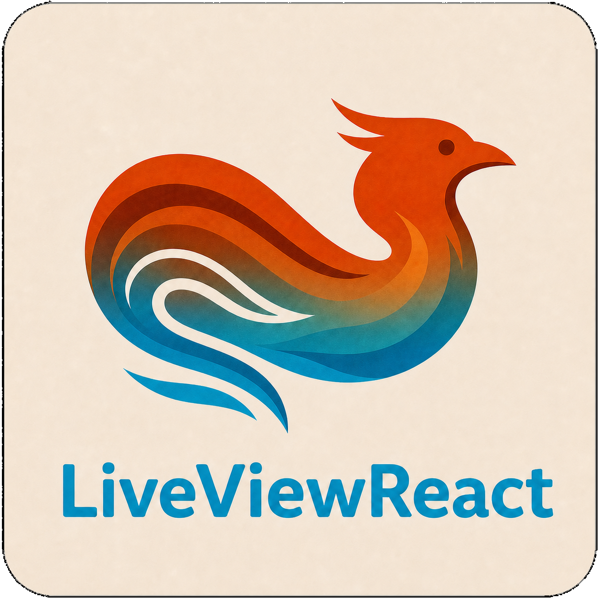

<p align="center">
  
</p>

<p align="center">
  <a href="https://github.com/geonwoo-jeong/liveview_react/blob/main/README.md">English</a> ·
  <a href="https://github.com/geonwoo-jeong/liveview_react/blob/main/README.ko.md">한국어</a> ·
  <a href="https://github.com/geonwoo-jeong/liveview_react/blob/main/README.ja.md">日本語</a> ·
  <a href="https://github.com/geonwoo-jeong/liveview_react/blob/main/README.zh-CN.md">简体中文</a>
</p>

<p align="center">
  <strong>在 Phoenix LiveView 中使用 React 19，同时仍由 LiveView 掌控全局。</strong>
</p>

<p align="center">
  <a href="https://hexdocs.pm/liveview_react">HexDocs</a> ·
  <a href="https://hex.pm/packages/liveview_react">Hex</a> ·
  <a href="https://github.com/geonwoo-jeong/liveview_react/blob/main/guides/getting_started.md">快速入门</a> ·
  <a href="https://github.com/geonwoo-jeong/liveview_react/blob/main/guides/comparison.md">对比</a> ·
  <a href="https://github.com/geonwoo-jeong/liveview_react/blob/main/guides/limitations.md">限制</a>
</p>

LiveViewReact 会在 Phoenix LiveView 内挂载标准的 React 根节点。LiveView
继续负责路由、权威的服务端状态、验证、重连和 DOM 替换。React 仅负责你
显式挂载的组件树。它不会创建第二个套接字、隐藏的全页面根节点或 SPA 运行时。

如果你正在评估它是否适用，请先阅读[为何使用](#为何使用)、[运行时模型](#运行时模型)
和[边界](#边界)。

## 功能特性

- **真正的 React 19 根节点** — 每次调用 `<.react>` 都会创建一个显式且独立管理的根节点
- **端到端的 LiveView 响应式能力** — 服务端 assign 通过不可变快照和写时复制补丁更新
  React props，而无需将权威状态移至浏览器
- **SSR 与水合** — 同一个组件注册表同时支持开发环境 SSR、生产环境 Node.js SSR、
  无 JavaScript HTML 和浏览器水合
- **高效传输** — 紧凑的 prop 差异和 Phoenix Streams 操作会更新现有根节点，
  同时保留 React 本地状态
- **LiveView 互操作性** — 支持事件、Promise 回复、导航、连接状态、表单、上传和直接使用
  `phx-*` 属性
- **惰性 HTML 插槽** — HEEx 元素主体会作为 React `children` 传入，
  `<:slot name="...">` 条目则会在文档所述的[非交互边界](guides/slots.md)内作为同名 prop 传入
- **生命周期安全** — 条件移除、缓慢的实时导航、重连、延迟导入和重复销毁都只会完成一次清理
- **类型安全的 Vite 集成** — 严格的 TypeScript、虚拟组件注册表、React Refresh，
  以及相匹配的浏览器端和服务端入口
- **一条命令完成配置** — Igniter 安装器会配置 PhoenixVite、React、TypeScript、SSR，
  以及一个可选的可运行示例

## 为何使用

对于大多数 Phoenix 页面，纯 LiveView 仍然是正确的默认选择。当页面中某个边界明确的区域
确实需要 React 本身时，请使用 LiveViewReact：

- 仅支持 React 的组件库
- 大量本地交互，否则这些交互将演变为命令式 hook
- Context、portal、Suspense、transition、canvas 或 WebGL
- 应保留在服务端拥有的 LiveView 页面内的客户端小组件

如果 React 应负责整个页面外壳、路由和远程数据生命周期，请改用 SPA 或 Inertia 风格的架构。

## 安装

在 Phoenix 应用程序根目录中运行：

```sh
mix igniter.install liveview_react
```

安装器会连接并配置 PhoenixVite、React、TypeScript、浏览器入口、SSR 入口和组件注册表。

常用变体：

- `mix igniter.install liveview_react --bun`
- `mix igniter.install liveview_react --no-demo`

在 umbrella 项目中，请从 Phoenix 子应用程序运行安装器，而不是从 umbrella 根目录运行。

如果 `mix igniter.install` 不可用，请先使用
`mix archive.install hex igniter_new` 安装 Igniter archive。然后运行 `mix assets.setup` 和
`mix phx.server`；生成的演示可通过 `/liveview-react` 访问。有关生成文件和资源工作流的完整说明，
请参阅[安装](guides/installation.md)。

## 第一个组件

创建 `assets/react-components/Counter.tsx`：

```tsx
import { useState } from "react";
import { useLiveViewReact } from "liveview_react";

type CounterProps = {
  readonly count: number;
};

export default function Counter({ count }: CounterProps) {
  const [errorMessage, setErrorMessage] = useState<string | null>(null);
  const { pushEvent } = useLiveViewReact();

  async function increment() {
    setErrorMessage(null);

    try {
      await pushEvent("increment", { by: 1 });
    } catch {
      setErrorMessage("The server could not process the increment");
    }
  }

  return (
    <>
      <button type="button" onClick={() => void increment()}>
        Count: {count}
      </button>
      {errorMessage && <p role="alert">{errorMessage}</p>}
    </>
  );
}
```

在 LiveView 中渲染它：

```heex
<.react
  id="account-counter"
  component="Counter"
  socket={@socket}
  count={@count}
/>
```

在 LiveView 中初始化服务端状态并处理事件：

```elixir
def mount(_params, _session, socket) do
  {:ok, assign(socket, count: 0)}
end

def handle_event("increment", %{"by" => by}, socket)
    when is_integer(by) and by in 1..10 do
  socket = update(socket, :count, &(&1 + by))
  {:reply, %{count: socket.assigns.count}, socket}
end

def handle_event("increment", _params, socket) do
  {:reply, %{error: "increment must be an integer from 1 through 10"}, socket}
end
```

默认注册表使用组件在 `assets/react-components` 下不带扩展名的路径作为名称，
因此 `assets/react-components/Counter.tsx` 会变为 `"Counter"`。

## 运行时模型

LiveView 负责：

- 权威的应用程序状态
- 路由和实时导航
- 验证和持久化
- 重连和替换生命周期
- 上传和服务端事件

React 负责：

- 一个已挂载根节点内的本地 UI 状态
- 该根节点内的 Context
- 受控输入、动画和第三方小组件
- 由该根节点创建的 portal

常规 prop 更新会重新渲染现有根节点，并保留 React 本地状态。移除 `<.react>` 元素、
更改其 `id` 或更改其 `component` 都是有意设置的重新挂载边界。

## 客户端 API

LiveViewReact 导出：

- `createLiveViewReact`
- `createLiveViewReactServer`
- `useLiveViewReact`
- `useLiveEvent`
- `useEventReply`
- `useLiveConnection`
- `useLiveNavigation`
- `useLiveForm`
- `useLiveUpload`
- `Link`

请从 effect 或事件处理程序中调用桥接命令，绝不要在渲染期间调用。
`useLiveViewReact()` 返回的底层命令会有意地在 SSR 和水合渲染阶段抛出异常；
内置 hook 会提供文档所述的提交后水合行为。请参阅[客户端 hook](guides/client_hooks.md)。

最小化客户端入口：

```tsx
import { Socket } from "phoenix";
import { LiveSocket } from "phoenix_live_view";
import components from "virtual:liveview-react/components";
import { createLiveViewReact } from "liveview_react";

const liveViewReact = createLiveViewReact({ components });

const liveSocket = new LiveSocket("/live", Socket, {
  hooks: {
    ...liveViewReact.hooks,
  },
  params: { _csrf_token: csrfToken },
});
```

最小化 SSR 入口：

```tsx
import components from "virtual:liveview-react/components";
import { createLiveViewReactServer } from "liveview_react/server";

export const { render } = createLiveViewReactServer({ components });
```

## Streams、插槽与导航

- Phoenix `stream/3` 数据可以直接作为 prop 传入；React 会收到物化后的不可变数组，
  其中包括 `__dom_id`。
- HEEx 元素主体和每个 `<:slot name="...">` 条目都会以惰性 HTML 包装器的形式传入 React。
- 实时导航会精确执行清理，并防止已销毁的 hook 之后出现延迟挂载 React 的情况。

## 边界

以下是有意设置的产品约束，而不是兼容性缺陷：

- 每个 `<.react>` 都是独立的 React 根节点。无法跨根节点共享 Context。
  如果多个小组件需要同一个 provider 树，它们应位于一个更大的根节点中。
- 外层 LiveView 元素仅用于传输。公共包装器样式选项不属于契约的一部分。
- 插槽 HTML 使用失败即关闭的被动标记允许列表。链接、表单控件、加载资源的标签、
  事件/样式/URL 属性、`phx-*`、`phx-hook`、嵌套 LiveView 和嵌套 LiveViewReact 根节点都会被拒绝。
- 文件输入仍必须由 Phoenix 使用 `<.live_file_input>` 在 React 所有的目标区域之外渲染。
  React 无法重新创建 Phoenix 的上传内部机制。
- SSR 使用 `renderToString`，而不是 React 流式 SSR。
- 生产环境 SSR 需要单独构建的服务端 bundle、可选的 `nodejs` 依赖项和 supervisor，
  并且发布镜像中需要包含 Node.js。请参阅[部署](guides/deployment.md)。
- 最初的公开浏览器支持契约仅涵盖 Chromium。在 CI 中运行等效的浏览器生命周期通道之前，
  不宣称支持 Firefox 和 WebKit。
- 本库不是全页面 SPA 路由器，也不会让 React 负责远程数据获取。

## 要求

- Elixir 1.20+
- OTP 27+
- Phoenix 1.8+
- Phoenix LiveView 1.2.11+
- React 和 ReactDOM 19.x
- 生成的 TypeScript 配置需要 TypeScript 7.x
- 生成的资源集成需要 Vite 8.x
- 默认资源和 SSR 配置需要 Node.js 24+

## 指南

- [快速入门](guides/getting_started.md)
- [安装](guides/installation.md)
- [组件 API](guides/component_api.md)
- [客户端 hook](guides/client_hooks.md)
- [事件](guides/events.md)
- [表单](guides/forms.md)
- [上传](guides/uploads.md)
- [Streams](guides/streams.md)
- [插槽](guides/slots.md)
- [SSR](guides/ssr.md)
- [延迟加载](guides/lazy_loading.md)
- [架构](guides/architecture.md)
- [对比](guides/comparison.md)
- [限制](guides/limitations.md)
- [测试](guides/testing.md)
- [开发](guides/development.md)
- [部署](guides/deployment.md)
- [卸载](guides/uninstallation.md)
- [发布](guides/releasing.md)
- [可运行的 Phoenix 示例](https://github.com/geonwoo-jeong/liveview_react/tree/main/liveview_react_examples)

## 开发

项目检查：

```sh
mix quality
npm run quality
npm run test:e2e
```

本仓库在 `liveview_react_examples` 下包含一个 Phoenix 示例应用程序，用于验证 SSR、
生命周期、stream、插槽和导航。

面向维护者的验证还包括 `mix quality_full`、`npm run quality:ci` 和托管的
Release Please 工作流。合并发布 PR 前，请参阅[测试](guides/testing.md)和[发布](guides/releasing.md)。

## 致谢

LiveViewReact 最初是 Baptiste Chaleil（Mrdotb）的
[LiveReact](https://github.com/mrdotb/live_react) 的一个分支。此后，它经过了大幅重新设计与实现，
成为一个拥有自身包标识、公共 API、运行时和传输协议的独立项目。对于继承而来的代码部分，
仍保留原始 MIT 版权声明。

本项目也从 [LiveVue](https://github.com/Valian/live_vue) 和
[LiveSvelte](https://github.com/woutdp/live_svelte) 中获得了大量启发，尤其是在 LiveView 集成、
SSR、stream、插槽和开发者体验方面。

## 许可证

Copyright (c) 2026 Geonwoo Jeong. Portions copyright (c) 2024 Mrdotb.
根据 [MIT License](LICENSE.md) 发布。
